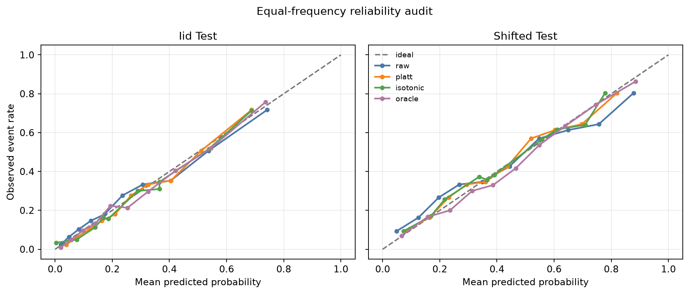
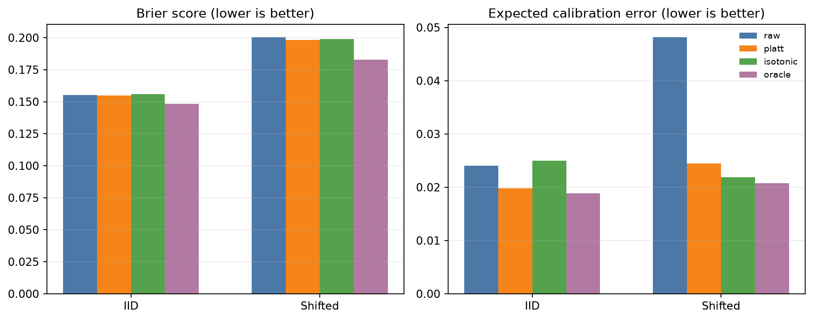
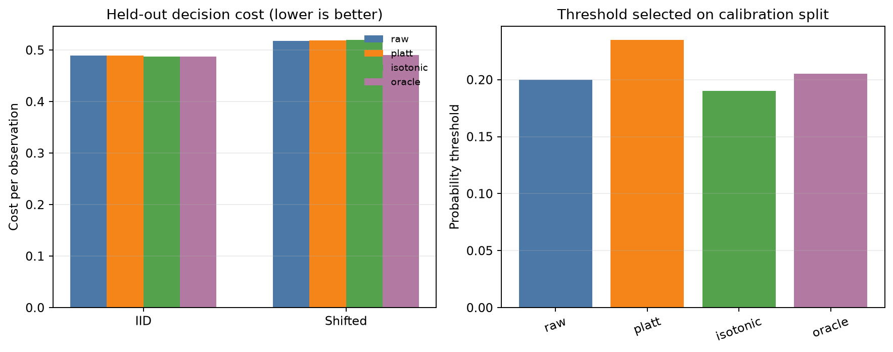

# Probability Calibration Audit Lab

A compact, reproducible machine-learning audit of raw, Platt-scaled, and
isotonic probabilities on independent IID and covariate-shifted test sets.
The project separates model training, calibrator fitting, threshold selection,
and final evaluation to avoid evaluation leakage.

## What this demonstrates

- Held-out post-hoc probability calibration for a nonlinear classifier.
- Equal-frequency reliability diagrams, Brier score, log loss, and ECE.
- An oracle benchmark made possible by a known synthetic data-generating process.
- Covariate-shift auditing without changing the conditional outcome mechanism.
- Cost-sensitive threshold selection using a 4:1 false-negative/false-positive cost.
- Nonparametric bootstrap intervals for Brier score and ECE.
- Deterministic tests for simulation, calibration, metrics, and the full workflow.

## Data and evaluation design

All data are generated locally from a documented five-feature nonlinear logistic
mechanism. The shifted test set changes selected feature means and scales while
retaining the same `P(Y|X)`. There is no private or externally downloaded data.

Four independent samples have distinct roles:

1. Train the histogram gradient-boosting classifier.
2. Fit Platt and isotonic calibrators and select decision thresholds.
3. Evaluate once on an IID test set.
4. Evaluate once on a covariate-shifted test set.

The `oracle` row uses the generator's true probabilities. It is a simulation
reference, not a model available in real deployment.

## Quick start

Requires Python 3.10 or newer.

```bash
python -m venv .venv
source .venv/bin/activate
python -m pip install -e ".[dev]"
pytest -W error
python -m probability_calibration_audit_lab \
  --output-dir artifacts \
  --train-size 4000 \
  --calibration-size 2200 \
  --test-size 3000 \
  --bootstrap 200 \
  --shift 1.0 \
  --seed 20260919
```

## Reproducible result

The checked-in artifacts use the command above. Reported results apply only to
this deterministic generator, model, sample sizes, split, and seed.

| Split | Method | Brier | Log loss | ECE | ROC AUC | Decision cost |
| --- | --- | ---: | ---: | ---: | ---: | ---: |
| IID | Raw | 0.1552 | 0.4730 | 0.0240 | 0.7882 | 0.4890 |
| IID | Platt | 0.1550 | 0.4725 | 0.0198 | 0.7882 | 0.4890 |
| IID | Isotonic | 0.1559 | 0.4802 | 0.0250 | 0.7837 | 0.4873 |
| IID | Oracle | 0.1484 | 0.4537 | 0.0189 | 0.8066 | 0.4873 |
| Shifted | Raw | 0.2005 | 0.5887 | 0.0482 | 0.7540 | 0.5173 |
| Shifted | Platt | 0.1981 | 0.5799 | 0.0245 | 0.7540 | 0.5183 |
| Shifted | Isotonic | 0.1990 | 0.5947 | 0.0219 | 0.7510 | 0.5200 |
| Shifted | Oracle | 0.1827 | 0.5430 | 0.0208 | 0.7919 | 0.4903 |

Platt scaling slightly improves all three probability scores on the IID test.
Under covariate shift, it cuts the point-estimate ECE from 0.0482 to 0.0245 and
improves Brier score and log loss, but it does not improve the downstream cost
at the threshold selected on the calibration split. Isotonic calibration has the
lowest shifted-test ECE among fitted methods, yet worse shifted log loss and
decision cost than Platt. This is why the audit reports multiple metrics rather
than declaring one universally best calibrator. The 200 bootstrap resamples are
included in `bootstrap_metrics.csv`; for example, the shifted raw and Platt ECE
95% percentile intervals are `[0.0385, 0.0680]` and `[0.0207, 0.0435]`.







## Interpretation boundaries

Calibration quality is distribution-dependent: a method that helps on the IID
test need not help after shift. ECE also depends on binning and can hide local
errors, so it is reported alongside proper scoring rules and reliability curves.
Bootstrap intervals measure sampling sensitivity conditional on the fitted
pipeline; they do not include retraining variability. The selected cost ratio is
illustrative and should be elicited from domain stakeholders in a real system.

This project does not claim that synthetic performance transfers to any real
application, population, or deployment environment.

## Repository layout

```text
src/probability_calibration_audit_lab/
  simulation.py  # nonlinear data generator and covariate shift
  calibration.py # Platt and isotonic calibration
  metrics.py     # reliability, proper scores, and decision costs
  evaluation.py  # leakage-safe end-to-end audit
  reporting.py   # CSV/JSON outputs and charts
  cli.py         # reproducible command-line workflow
tests/            # unit and end-to-end tests
artifacts/        # checked-in outputs from the documented run
```

## License

MIT
